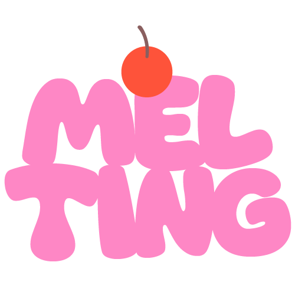

# 프로젝트 소개

Melting은 인기 커뮤니티 사이트를 통합한 커뮤니티 사이트입니다. 
디시인사이드, 더쿠 등 다양한 인기 사이트를 제공하며 원하는 게시글을 스크랩 할 수 있습니다.

# 기능
- 회원가입, 로그인
- 게시글 읽기, 쓰기, 삭제, 수정, 추천, 검색, 공유
- 댓글 달기, 삭제
- 마이페이지 쓴 글 알림, 댓글 알림, 글 스크랩

# 개발 기간
- 1차 : 2023년 5월 16일 ~ 2023년 6월 6일
- 2차 : 2023년 6월 7일 ~ (진행중)

#  기술 스택
- 
Frontend 

&nbsp;&nbsp;&nbsp;&nbsp;&nbsp;

- 
Backend 

&nbsp;&nbsp;&nbsp;&nbsp;&nbsp;

- 
Database 

&nbsp;&nbsp;&nbsp;&nbsp;&nbsp;

- 
VCS

&nbsp;&nbsp;&nbsp;&nbsp;&nbsp;

- 
Editor

&nbsp;&nbsp;&nbsp;&nbsp;&nbsp;

- 
API

&nbsp;&nbsp;&nbsp;&nbsp;&nbsp;

- 
ETC

&nbsp;&nbsp;&nbsp;&nbsp;&nbsp;

  

# 조원 소개
- 김지원 : 백엔드
- 홍세빈 : 프론트엔드

# 이용 가능 커뮤니티
1. 디시 인사이드
2. 뽐뿌
3. 더쿠
4. 루리웹(예정)
5. 인벤(예정)

# 협업 Notion
(추후 추가)

